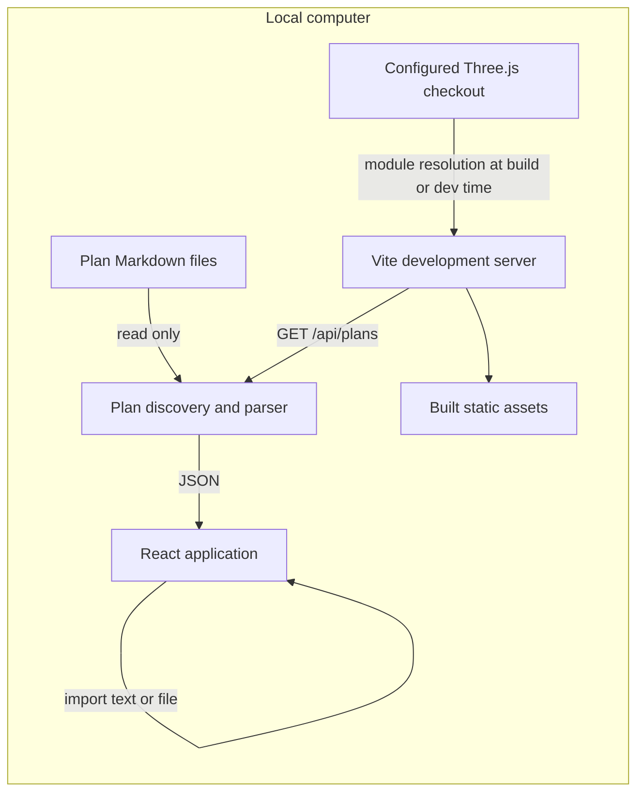

# Wazi architecture

Wazi is a local, read-only plan viewer. Markdown files remain the source of truth. The browser receives parsed task records; it does not save changes back to a plan, and there is no database or remote ingestion path in this prototype. The boundaries and behavior below are derived from the current source, rather than promises about future behavior.

## Runtime shape

The development server binds to loopback. Its Vite middleware implements `GET /api/plans`; it checks the request method, host, and cross-site/origin headers before scanning files. The response is JSON with `projects`, `warnings`, and `scannedAt`, and is marked `no-store`. It does not validate the full response schema. An exception escaping the route returns HTTP 500 with a generic import suggestion. Individual file failures ordinarily produce a successful response with warnings; discovery-directory failures can be skipped silently. The browser calls this endpoint on mount and when Refresh is clicked. See [vite.config.mjs](../vite.config.mjs#L8) and [App.jsx](../src/App.jsx#L24).

The API exists in Vite's development-server middleware. `vite build` emits static assets under `dist/client`; a static build has no plan-reading endpoint, so it starts with the labeled example plan and supports browser-side Markdown imports. Build and preview do not add a server-side data service. This follows from the `configureServer` middleware and the build output configuration in [vite.config.mjs](../vite.config.mjs#L8).

## Modules and responsibilities

| Part | Responsibility |
| --- | --- |
| [vite.config.mjs](../vite.config.mjs#L7) | Resolves Three.js and its addons from the configured local checkout; runs the local API middleware in development; binds Vite to loopback. |
| [scripts/plans.mjs](../scripts/plans.mjs#L32) | Finds supported plan files beneath the selected root, applies discovery bounds, parses files, derives cross-plan dependency status, and returns projects with warnings and scan time. |
| [src/plan-parser.mjs](../src/plan-parser.mjs#L138) | Browser-safe Markdown parser shared by filesystem scanning and in-browser imports. |
| [src/App.jsx](../src/App.jsx#L9) | Owns project/plan selection, filters, import handling, local refresh, the task inspector, and React view state. |
| [src/Space.jsx](../src/Space.jsx#L8) | Builds and renders the Three.js scene, task dependency geometry, camera controls, and aligned DOM task cards. |
| [src/demo.mjs](../src/demo.mjs#L20) | Provides explicitly labeled illustrative sample data and maps plan stages into the five display lanes. |

The app imports Manrope and IBM Plex Mono from bundled Fontsource packages and uses Phosphor React components for interface icons. Three.js and `OrbitControls` resolve through Vite aliases to the configured local Three.js checkout; the application does not load those assets from a CDN. The browser build therefore needs that checkout available while Vite resolves and bundles the modules. See [src/main.jsx](../src/main.jsx#L1), [package.json](../package.json#L12), and [vite.config.mjs](../vite.config.mjs#L24).

## Rendering model

React owns the readable task buttons, lane labels, navigation, filters, and inspector as ordinary DOM. Three.js owns the WebGL canvas: the scene includes a grid, horizon, stars, task markers, and curved dependency lines with arrowheads. Each frame, the renderer projects each card's corresponding 3D position into screen coordinates, scales it with camera distance, and hides cards outside the camera view. This keeps text and button interaction in the DOM while the cards track the 3D camera. See [Space.jsx](../src/Space.jsx#L20) and [Space.jsx](../src/Space.jsx#L54).

Task geometry is rebuilt when the task list or measured canvas size changes. Dependencies are drawn only when both endpoints exist among the currently visible nodes. Selecting a task emphasizes its links and dims unrelated links; the inspector still shows dependency IDs that are outside the selected plan as “Outside this plan.” Camera controls support orbit, pan, and zoom; resize returns the camera to its home framing. Cleanup cancels the animation frame, disconnects the resize observer, disposes controls, geometries, materials, and renderer. See [Space.jsx](../src/Space.jsx#L76).

## Trust and persistence boundaries

The filesystem scanner reads plan Markdown and returns parsed data; it does not modify source files. Its root defaults to the user's `Code` directory and can be changed with `WAZI_PLAN_ROOT`. It recognizes `plan.md`, `docs/plan.md`, and Markdown files directly under `docs/plans/`. Although plan display paths are repository-relative, a scanned task's `source` field retains the project-qualified path passed to the parser and can therefore contain an absolute local path. The route is constrained to local requests, but it is not an authorization system: there is no sign-in, per-project permission model, or remote API. Treat the local development process and its selected scan root as trusted local access. See [vite.config.mjs](../vite.config.mjs#L11), [scripts/plans.mjs](../scripts/plans.mjs#L138), and [scripts/plans.mjs](../scripts/plans.mjs#L115).

File imports and pasted Markdown stay in React memory for the current page session. Refresh re-reads scanned projects while retaining imported in-memory projects; reloading the page drops imports. Neither the scanner nor UI writes a plan, stores a database record, or uploads data. See [App.jsx](../src/App.jsx#L28) and [App.jsx](../src/App.jsx#L34).

## Verification provenance

This document records code-derived behavior. It does not assert a new build, test run, or browser check. Existing repository verification notes remain in [docs/devlog.md](./devlog.md) and [docs/review.md](./review.md); those are historical evidence and should not be read as checks performed while writing this architecture document.

Source snapshot: `8c5486d`. The proposed traceability extension is documented separately in [RFC 0002](rfc/0002-plan-code-evidence-traceability.md); it is not part of this runtime architecture.

## E3 candidate architecture

The historical snapshot above describes the pre-E3 prototype. The E3 candidate adds a Go loopback host (`cmd/wazi`, `internal/observatory`), a bounded parser bridge (`scripts/host-bridge.mjs`), an application routing boundary (`internal/app`), a scoped read-only owner adapter (`internal/context`), and private analysis persistence (`internal/deep`). It serves the built React/Three.js frontend. Browser import remains in memory; confirmed source links write only the selected repository's versioned sidecar. Credentials and private results remain in host-owned app data.

Serenity transport remains a required unqualified owner capability. The adapter contract and fixture validation are implemented independently of a live reader; all five sections are unavailable when there is no supported authenticated scoped reader. This candidate architecture does not claim full E3 acceptance. Delivery evidence and the remaining owner gate are in `docs/e3-checkpoint.md` and `docs/plan.md`.
