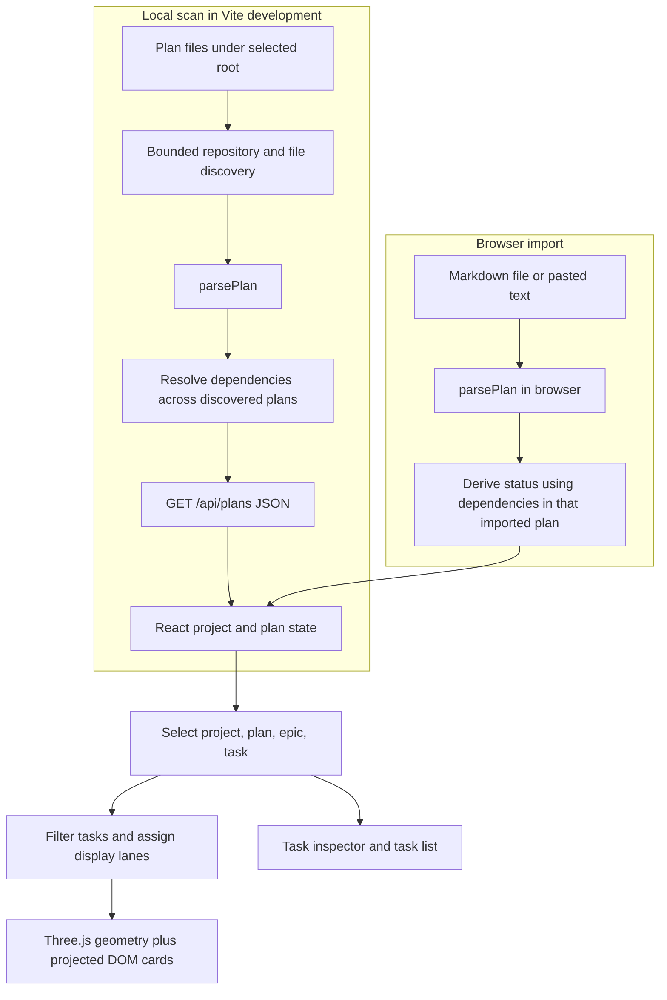

# Wazi plan data flow

The plan files and the user's imported Markdown are the only input sources. Both paths use the same parser, but filesystem scanning adds project discovery and cross-plan dependency status. The browser then normalizes task IDs for selection and renders the selected plan. No plan changes are written back.

## End-to-end paths



In development, the browser fetches `/api/plans` at mount and when the user presses Refresh. The server accepts GET only, checks local host and cross-site/origin headers, then calls the scanner. A successful response has this shape:

```json
{
  "projects": [
    {
      "id": "project-…",
      "name": "…",
      "plans": [
        {
          "id": "plan-…",
          "title": "…",
          "path": "docs/plan.md",
          "project": "…",
          "tasks": [],
          "epics": [],
          "warnings": []
        }
      ]
    }
  ],
  "warnings": [],
  "scannedAt": "…"
}
```

Each parsed task carries `id`, `sourceId`, `title`, `status`, `stage`, `epicId`, `epicTitle`, `owner`, `acceptance`, `dependencies`, `line`, and `source`. The parser's `id` is a deterministic four-lane FNV-style hashed key from project, source path, and source ID. `sourceId` is the explicit leading task identifier when recognized, uppercased; otherwise it is `line-N`. After parsing, the UI replaces `id` with `sourceId` when present, so selection, displayed IDs, and dependency matching use source identifiers. Duplicate source IDs in one file therefore collide as UI task IDs; the parser does not diagnose them. The parser-generated ID also collides for duplicate source IDs under the same project and path. See [plan-parser.mjs](../src/plan-parser.mjs#L138) and [App.jsx](../src/App.jsx#L7).

For scanned files, the scanner passes a project-qualified absolute source path to the parser to make its initial IDs unique across projects, then changes the plan's `path` back to a repository-relative path for display. Each task's `source` string keeps the parser-provided source path and line, so it can contain the local absolute path. Imports instead use the supplied filename. See [plans.mjs](../scripts/plans.mjs#L138) and [plan-parser.mjs](../src/plan-parser.mjs#L168).

## Discovery and parse limits

The scanner checks each visited directory for `plan.md`, `docs/plan.md`, and direct Markdown files in `docs/plans/`. It stops descending when it reaches a Git root or finds any supported plan file, including in a non-Git directory. It also skips hidden, dependency, generated, temporary, and recognized worktree directories, and prevents revisiting the same real path. Discovery is bounded to depth 3 and 12,000 counted eligible directory entries; it indexes at most 120 split plans per repository and skips individual files larger than 1,000,000 bytes. It returns warnings when repository traversal or split-plan indexing hits a cap, a plan is too large, a plan cannot be read, or an unexpected scan exception escapes discovery. Directory/realpath failures, including an unreadable or missing scan root, can instead return an empty result silently. See [plans.mjs](../scripts/plans.mjs#L9), [plans.mjs](../scripts/plans.mjs#L32), and [plans.mjs](../scripts/plans.mjs#L115).

The parser ignores fenced code blocks and reads Markdown task checkboxes. It recognizes task IDs at the start of task text; headings define plan titles and nearby `E…` headings define epics. Task metadata includes stage, owner, status, dependency aliases (`blocked-by`, `deps`, `dependencies`), and acceptance aliases. A task's source records the plan path and Markdown line. It does not interpret every Markdown convention: unrecognized lines are not tasks, and it does not evaluate acceptance prose. See [plan-parser.mjs](../src/plan-parser.mjs#L129).

## Status derivation

The shared parser derives status from checkbox and optional status metadata: `[x]` is complete, `[~]` is active, `[-]` is blocked, and `[ ]` defaults to pending unless explicit status is exactly `blocked`, `active`, or `in-progress` (case-insensitive) in the supported syntax. For filesystem scans, a second pass resolves dependencies across all plans in a project using source IDs. A missing ID adds an unresolved-dependency warning to the plan; an incomplete matched dependency changes a non-complete dependent task to blocked. For browser imports, dependencies are checked only against tasks in that one imported plan. Pending imported tasks with a found, incomplete dependency become blocked; unresolved IDs do not produce warnings. These paths differ in scope. Per-plan warnings are included in JSON but the UI notice only displays the first top-level scanner warning. See [plan-parser.mjs](../src/plan-parser.mjs#L163), [plans.mjs](../scripts/plans.mjs#L94), and [App.jsx](../src/App.jsx#L24).

## Selection and display

The project selector chooses the first non-empty plan when available. The plan selector resets epic and task selection; the epic selector filters tasks to one epic. Stage maps to five lanes using exact, case-sensitive names: `preflight`, `implement`, `verify`, and `review` map directly, `merge` and `verify-landed` map to Land, and missing or unknown stages fall into Build. For each lane, the scene displays up to four filtered tasks. If the selected task would otherwise be outside those four, it replaces the last card in that lane. The task list still exposes all filtered tasks. The status legend changes card emphasis; it does not remove tasks. See [demo.mjs](../src/demo.mjs#L26), [App.jsx](../src/App.jsx#L18), and [Space.jsx](../src/Space.jsx#L14).

Three.js draws a dependency connection only when both the task and dependency are present in the visible node set. Thus a dependency in another plan, another epic, or beyond the four-per-lane scene limit has no line in the current view. The inspector lists each task dependency, labels unresolved or out-of-plan IDs “Outside this plan,” and offers links to tasks found in the selected plan. It also lists tasks in the selected plan that depend on the current task. See [Space.jsx](../src/Space.jsx#L79) and [App.jsx](../src/App.jsx#L75).

## Refresh, imports, and errors

On refresh, the UI replaces scanned projects with the new response while keeping imported projects already in memory. A failed HTTP response, invalid JSON or a non-array `projects` field, or network error leaves the user with the current in-memory state and shows a generic message that local plans are unavailable. If the server returns warnings, the UI shows the first warning as a notice. A server-side scan exception returns a generic HTTP 500 response; individual scanner errors are reported in warnings where possible. See [App.jsx](../src/App.jsx#L24) and [vite.config.mjs](../vite.config.mjs#L17).

Imported Markdown goes straight through `parsePlan` in the browser and is added to React state. Files over 2,000,000 bytes are skipped with a notice; decode/read/parse exceptions show an import error. A Markdown document with no recognized task checkboxes is rejected with a stable-ID hint. Imports last only until the page reloads. A static build can still use the bundled example and this import path, while filesystem discovery depends on the Vite development server's local API. The example plan remains explicitly labeled as illustrative sample data. See [App.jsx](../src/App.jsx#L34) and [demo.mjs](../src/demo.mjs#L20).

## Evidence note

The descriptions above are code-derived from the linked implementation and parser tests. No new tests, build, or browser checks were run for this document. Any verification mentioned in [docs/devlog.md](./devlog.md) or [docs/review.md](./review.md) is inherited historical evidence, not a result of this documentation task.

## E3 candidate flow

Go host → bounded plan discovery/parser bridge → existing plan JSON → preserved React scene. Explicit project selection → bounded code snapshot → explained source/test proposals → user review → atomic versioned sidecar confirmation. Source previews and reverse task navigation use the selected snapshot and repository-relative file identity. Stale snapshot/sidecar inputs reject mutations.

Explicitly configured repository scope → qualified read-only Serenity reader → five typed sections → leased browser view. Missing owner APIs produce unavailable sections, never brain-wide fallback. Explicit deeper-analysis click → host recaptures plan and confirmed code links → verifies exact displayed-context lease → lineage gate → private dispatch receipt/capacity reservation → configured provider → completed result. Exact qualified inputs may reuse completed results; unknown dispatches never resend automatically. Negative lineage invalidates bodies and unavailable lineage hides them. The explicit plan/code-only operation excludes memory. No provider call occurs from discovery, project selection, refresh or unavailable-context inspection.
