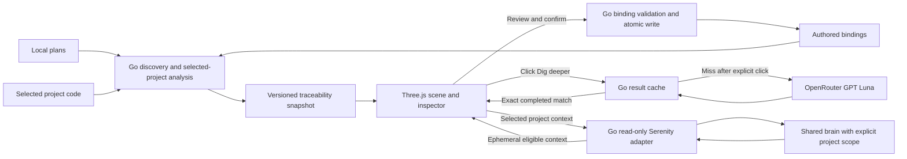

# RFC 0002 — Go plan, code and Serenity observatory

- Status: settled design; not implemented.
- Design digest: `WAZI-DESIGN-DIGEST-v1`, exact semantic candidate `53f830d9ae31beb9651a8876e8f7d285eca7eb5a`. All direct user choices resolved; peer concurrence and independent review passed.
- Date: 2026-10-03 (peer exchange continued on 2026-10-04 UTC).
- Baseline: [RFC 0001](0001-local-plan-observatory.md) describes the existing read-only React/Three.js prototype.
- Decision record: [ADR 0001](../adr/0001-go-observatory-and-context.md).

## Product intent and first version

Wazi lets the owner discover local delivery plans, choose a project, and explore how its tasks relate to implementation, tests and remembered project context. Preserve the deep ink canvas, cyan/periwinkle accents, spatial stage lanes and inspectable dependency paths inspired by the original reference. The complete task list and readable inspector remain available alongside the scene.

The user explicitly selected:

- Settle this design with the other Codex session, record it, then stop.
- Discover local plans; analyze code only for projects the user selects.
- Suggest links automatically, for the user to review and confirm.
- Include read-only Serenity context alongside plan/code navigation from the start: project facts, relevant decisions, constraints, intents and open questions, with unavailable sections shown honestly.
- Use a shared Serenity brain scoped to the selected project.
- Use local analysis first. Load OpenRouter model `openai/gpt-6-luna` only when the user clicks to dig deeper, using selected plan/code plus project-scoped Serenity context shown in the panel. Persist eligible completed results so unchanged requests do not call AI twice.
- Build Wazi with a Go core and the existing Three.js browser interface (explicitly confirmed by the user).

First-version product scope includes declared bindings, deterministic suggestions, explicit confirmation, related-code/reverse navigation, click-triggered AI and read-only Serenity context. These may be delivered through separately verified increments; suggestions and context are not deferred to an unspecified future product version. No implementation follows from this design settlement.

## Ownership and application shape

The confirmed delivery shape is an on-demand Go local application serving the existing React/Three.js browser interface. Go owns discovery, selected-project analysis, bindings, versioned snapshots, local result persistence and credentialed Serenity/OpenRouter calls. The process runs for the app session, not as an installed system daemon. A CLI snapshot/export mode remains independently useful without a resident service or network calls.

The browser consumes bounded JSON and sends explicit selection/confirmation/deep-analysis requests. It cannot spawn a CLI, receive desktop credentials or select arbitrary filesystem paths. The Go host accepts only a loopback origin, applies Host/origin checks and a session-bound anti-CSRF capability to writes and paid requests. Binding/cache writes are new explicit app behavior; source plans and code remain read-only. Do not broaden the current Vite endpoint into an unrestricted file server.

The working JS parser may initially produce normalized input for Go through a fixed local bridge or fixture contract. Plan-source reading and eventual parser migration must preserve IDs, statuses, dependencies, warnings and import behavior. Translating a working parser is not a prerequisite for the first increment. Go remains the owner of new backend behavior; Three.js remains browser JavaScript. The user's local Three.js checkout is consumed without editing it.

| Responsibility | Owner | Authority boundary |
| --- | --- | --- |
| Plans and recorded task status | Source plan author | Wazi does not rewrite plans or mark tasks complete |
| Declared task/code bindings | User via Wazi | Confirmation is an explicit authored decision |
| Source facts and structural relationships | Reusable source adapter | File presence or a dependency is not acceptance |
| Suggestions and deeper analysis | Wazi local analysis / requested model | Candidates remain suggestions until confirmed |
| Memory facts, decisions, intents and eligibility | Serenity | Wazi reads supported surfaces; no canonical writes |
| Checks, reviews, landing and acceptance | Their recorded producers/authorized owners | Display only evidence actually available |
| Scene layout, camera and selection | Browser UI | Presentation state carries no source authority |

## Interaction design

Discover shows local projects and plans with bounded-scan warnings. Selecting a project starts its bounded code analysis; discovery does not inspect unrelated project code. Selecting a task opens a readable inspector with plan details, declared code/test links, candidate links and a separate Serenity context section. File targets support reverse navigation to related tasks. Scope and provenance remain visible.

The scene keeps plan dependency edges distinct from confirmed traceability edges, tentative suggestion edges and any supported code dependencies. Toggle each family; do not turn every source file or memory fact into a mandatory scene node. File-level implementation/test targets are the first baseline. Verified symbol spans may enrich detail without promising a universal multi-language resolver or complete impact graph.

Suggestions explain why a candidate was proposed, which plan/code evidence it used and when that basis was captured. A rank or score is not a probability of correctness. Confirm writes an authored binding; dismiss suppresses that candidate for its current basis. Users can also declare links manually. Refresh never silently confirms, deletes or replaces a decision. Changed inputs mark prior analysis stale.

Dig deeper first checks persisted results. An unchanged completed request shows its saved result with model/provenance and creation time. Changed inputs require a new explicit click; automatic scanning, refresh, opening panels and confirmation do not invoke AI. Model output is inert untrusted content, cannot execute tools or change task status, and cannot confirm its own links. Cancellation and failures are explicit; no automatic fallback provider/model or unbounded retry. Credentials remain in private local configuration.

## Binding identity and storage

Use versioned JSON `.wazi/links.json` as authored binding input. Generated snapshots are separate outputs. Persist private analysis results and configuration outside tracked project source; no source bodies, credentials, endpoints or home paths in the binding sidecar or graph export.

A privately assigned stable repository ID survives checkout moves; forks receive distinct IDs. Imported/cloned checkouts are deliberately associated with an existing identity, never inferred from display name or raw remote URL. A `TaskRef` is repository ID + repository-relative plan path + source task ID. Duplicate IDs within one plan are ambiguous and block confirmation. Line-derived IDs lack durable identity across edits; require a stable authored task ID before persisting a binding. Browser-imported Markdown remains unbound until deliberately mapped to a repository/plan/task.

A binding carries schema version, binding ID, qualified task reference, typed repository-relative implementation/test target, relationship, confirmation provenance/time and basis digest. One task may link to several targets and one target to several tasks. Planned absence is an author expectation, distinct from an observed disappearance. States include `planned_not_present`, `present`, `missing_after_reference`, `ambiguous`, `out_of_scope` and `stale`; presence and freshness should be separate fields where both apply.

Discovery may read bounded plan files under explicitly configured plan roots. Post-selection code reads, target resolution and repository binding-sidecar writes confine paths to the explicitly selected repository. Private configuration/results use their separate OS-user storage boundary; they are not repository source reads. Reject traversal, symlink escape, nonregular files and out-of-scope references. Source roots and shared-brain/project-entity mappings are private local configuration, never exported identities. Binding writes validate exact task/target basis, detect concurrent sidecar edits and use atomic persistence; conflicts require reconciliation, never last-writer-wins replacement.

## TraceabilitySnapshot contract and freshness

This is a design contract, not a published schema or existing command. Minimum records:

| Record | Required basis |
| --- | --- |
| `TaskRef` | Qualified identity, source digest/location, resolution/ambiguity state |
| `DeclaredLink` | Binding identity, typed target, authored provenance, expectation and confirmation basis |
| `Suggestion` | Candidate identity, task/target, derivation, evidence references, rank, input digests and optional model provenance |
| `SourceObservation` | Observed presence, digest, producer/version, capture time and freshness |
| `CheckEvidence` | Actual result, command/tool, exact source basis, time and evidence reference; absent when unavailable |
| `TraceabilitySnapshot` | Schema/producer versions, repository identity/revision, dirty-tree basis, plan/target digests, limits/warnings and generation time |

Capture the actual plan/code bytes and detect concurrent changes across reads. Git HEAD alone cannot describe a dirty checkout. Detect/refuse mixed evidence or mark the affected result invalid; do not present it as coherent. Stale suggestion/cache bases cannot silently become current evidence. Existing prototype path hashes/source-ID normalization need an explicit compatibility mapping rather than being treated as the new global identity.

No automatic test execution, PR import, review inference or acceptance judgment belongs to this first baseline. A test file is a linked source artifact. Passing tests, reviewed source, landed source and accepted task completion are different states.

## Requested AI and persistent reuse

Model/provider: OpenRouter, `openai/gpt-6-luna`, as selected by the user. Runtime availability, credentials, limits and request contract must be verified at implementation; no provider call has been made in this design work.

Cache key includes repository/task identity, operation/question, bounded input manifest with content digests, prompt/template version, analyzer/schema versions, provider/model and material generation settings. Persist completed outputs atomically and deduplicate concurrent identical requests across browser clients and app instances sharing the cache; failures are not completed answers. Persist a non-content request receipt before dispatch. A crashed/timed-out request with unknown completion remains unknown: never automatically resend it or claim a complete cached answer. Explicit regeneration must disclose that another charge may result; do not claim provider-level exactly-once execution without a supported contract. Reuse requires exact input equivalence, not just the same task title or Git HEAD. Store provenance and expiry/invalidity separately from bindings. Cache eviction or an explicit force re-run is a visible operation; never silently repeat a completed request.

Private result storage defaults to the current OS user's application-data directory (`~/Library/Application Support/Wazi` on macOS), with owner-only directories (0700) and files (0600). It is separate from checkout/worktree source and browser storage. Agent fixtures/caches remain on the external SSD; runtime data location is explicitly configurable. Keep provider credentials in the OS credential store or explicitly supplied process configuration, outside answer/config payloads; do not log keys, prompts, source bodies or answer bodies.

Plan/code-only completed answers persist until explicitly deleted; stale answers remain labeled historical and cannot serve current suggestions. Before any paid dispatch, enforce the configured storage limit, validate storage health and reserve capacity for the bounded output plus request receipt; insufficient capacity stops the request visibly. If the provider succeeds but output persistence still fails, return an explicit uncached state and retain a non-content completed-but-uncached receipt when writable. If that transition itself fails, the existing dispatched receipt remains unknown. Either state refuses automatic resubmission and requires explicit regeneration with cost disclosure; a missing answer body is not permission to call again. Never silently evict and re-spend. Provide inspect/delete and explicit regenerate controls. After deletion, a surviving non-content request receipt can indicate that regeneration will make a new request; user deletion can also remove that receipt. Cache files are not served directly over HTTP. Wazi performs no automatic body export/sync/backup and marks private result storage excluded from platform backup where supported; qualify and disclose the actual platform exclusion behavior, never promise control over a user's independent backups. Persistent memory-derived answers, if selected below, instead obey their additional eligibility/expiry/removal contract. No automatic repo artifact or Serenity memory write results from this cache.

The user explicitly permits selected plan/code plus the project-scoped Serenity context shown in the panel. The Go host verifies that every contextual record is currently eligible for the selected brain/audience/project before dispatch. The bounded input manifest contains exactly the displayed authorized context (after scope/eligibility filtering), with owner record references and content digests. No hidden records, broader brain material or unrelated project data enter the request. An expired/unverified panel must refresh through qualified provider-free reads before AI can use it; context fetch never itself invokes the model.

Such answers are retained memory-derived data even if raw prompts are discarded. Cache identity additionally binds brain, audience/account, project scope, the complete input-reference manifest, memory content/version digests and lifecycle/read-contract version. Before every reuse/display/export, revalidate each included reference's current eligibility, scope, expiry and content through the supported owner seam. A timestamp or Git revision is not a universal memory token. Changed inputs mark the answer stale and need a new explicit deep click; no automatic model regeneration follows.

On known forgetting/cancellation/expiry/inaccessibility or scope invalidation, hide and remove affected derived bodies, including local historical/export copies Wazi manages; a cached answer cannot resurrect excluded material. Ephemeral read context remains excluded from the ordinary snapshot/cache. No instant external-forget or independent-backup erasure guarantee is inferred without a qualified owner notification/backup contract. Sweep expired/known-invalidated entries before any startup display; while the app is offline no active deletion or live-eligibility guarantee is claimed. Memory-derived cached bodies remain hidden/unavailable until current scope, eligibility and content revalidation succeeds. An offline or unreachable owner seam cannot display, reuse or export them, including through historical/cache-inspection views; only non-content metadata and deletion controls remain available. The separate plan/code-only cache can remain usable offline.

Durable memory-derived reuse is a REQUIRED v1 qualification gate: the supported seam must revalidate all context types and their lineage, not just fact IDs. If that is unavailable, show persistence unavailable and do not retain/reuse a derived body; an explicitly requested answer may remain session-ephemeral with that limitation visible. This degraded state does not pass the full persisted-reuse gate or silently downgrade the user's chosen input scope. The app may offer a separate explicit plan/code-only deep operation whose outputs use the ordinary private cache, without choosing it on the user's behalf.

## Read-only Serenity context from the start

Use the user's shared brain with an explicit selected-project entity/scope mapping. A missing mapping produces context-unmapped; never recall the whole brain or infer scope from a project label. Account, audience, brain and entity remain explicit. Standalone plan/code navigation works if Serenity is unavailable.

The user selected project facts plus relevant decisions, constraints, intents and open questions. Each section has an explicit available/empty/unavailable state, records with stable owner references/type, nullable attribution/source pointers, fetched-at/validity metadata and enforced project/brain/audience scope. A fact is not relabeled a decision; code observations are not remembered judgments. Unknown membership or provenance stays unknown and cannot widen retrieval scope.

A supported provider-free project-scoped read seam for authored decisions/constraints/intents/questions is a REQUIRED first-version integration and acceptance dependency. The owner must qualify an existing surface or coordinate an additive Serenity-owned contract. Until qualified, the panel shows the missing section honestly; that degraded prototype state is not evidence that the complete v1 integration gate passed. After qualification, unavailable source/auth/scope/records remain truthful UI states. Do not defer this requirement outside v1, substitute global Brief, or expose unsupported private memory through canonical-file reads.

The peer reports source review at Serenity revision `bc4689434e7c25ab8e5674be8fd7df250c20b45b`. Its existing authenticated Streamable HTTP MCP is the candidate seam. Initial provider-free fact allowlist: `entity`, entity-scoped `recall` WITHOUT query, and `read_memory_fact` for an exact returned eligible fact ID. Qualify selected revision/assembly, authentication, protocol validation, audience/visibility, lifecycle/TTL/cancellation and bounded response limits before use. Source-built fixture checks and connection to the user's actual brain are separate evidence.

Read-only does not imply provider-free: the peer found Go facade `Recall` may invoke composer/embedding routes, and MCP `recall` with a query may invoke embedding. Do not call these on selection/refresh. `Brief`/DIRECTION are candidates to inspect for richer authored context but are not yet qualified typed/audience-safe panel contracts. Brief `TaskHint` ranks entity relevance; it does not enforce selected-project scope across precepts/intents/questions. Global Brief cannot substitute for a scoped read seam. If required sections cannot be served by an existing supported surface, coordinate an additive Serenity-owned read contract. Wazi must not read canonical files as a fallback, invent fields from partial facts, launch another writer, bypass auth or provision hosted service/credentials.

Keep memory bodies ephemeral, separate from TraceabilitySnapshot and graph exports. Re-fetch bounded detail on selection/refresh, with a finite local refresh lease (initial default 60 seconds) capped by source validity. No background polling or unqualified push listener is required; changing the lease is private local configuration, not a stronger eligibility guarantee. With no qualified push invalidation, the first design uses fetched-at display and expiry: once the lease ends, hide the body and show stale/unverified with Refresh; it does not promise instant external-forget updates. Discard on task/project/brain/audience changes, failed refresh or known invalidation. Cancel/discard late responses using request scope/version. Source timestamps are not a coherent canonical-memory snapshot token. Missing/private/expired/cancelled outcomes must not leak hidden existence. Nullable source locations and attribution stay unavailable.

No memory write, automatic memory synthesis, complete brain export or canonical graph inventory is in scope. Memory responses cannot authorize tools or override the user's plan/status.

## Data flow

Finite discovery/code-read/context/AI budgets are configured and surfaced with truncation warnings; secrets, credentials, dependency/build trees and files outside the selected repository are excluded from analysis inputs. Static analysis never runs repository scripts or tests. The context panel is a bounded read, not a whole-brain dump.

The AI input boundary is specified above; memory does not enter snapshots or the AI path unless the user explicitly selected that input scope. Browser credentials are never part of these arrows.

## Qualification and acceptance gates

1. Go host/CLI transport, loopback/session boundary and parser compatibility: demonstrate discovery and unchanged plan semantics with no code scan for unselected projects, bounded warnings, no source writes or browser credentials.
2. Bindings/snapshots: move/fork/duplicate identity cases, dirty and concurrently changed inputs, path confinement, atomic/conflicting sidecar writes and bidirectional navigation.
3. Suggestions/confirmation: deterministic explained candidates, stale evidence, explicit confirm/dismiss, no suggestion-to-status or automatic binding promotion.
4. Requested AI/cache: zero calls during discovery/selection/refresh, explicit click-only request, bounded input, exact cache reuse/in-flight deduplication, changed-input invalidation and cancellation/error states. Qualify actual model/provider separately from fixtures.
5. Serenity: scoped authenticated provider-free reads, visibility/TTL/forget/cancel behavior, unavailable sections/source pointers, expiry and late-response disposal; separately qualify richer authored context, full memory-lineage cache reuse/invalidation and actual brain connectivity. Until both rich scoped reads and eligible durable reuse are qualified, do not claim complete first-version delivery.
6. UI: readable complete task navigation, separate edge families/provenance, narrow-screen accessibility and honest disabled/stale states. Existing touch/no-WebGL gaps remain explicit.

Delivery needs a future executable plan with proportionate verification, independent review and local landed verification. New agent worktrees/caches/artifacts stay on the external SSD; Go multi-package checks obey the shared load/build-lease rules. This design record assigns no implementation lane and does not claim these gates passed.

## Settlement evidence

Go+browser is explicitly confirmed by both user conversations (`WAZI-DESIGN-USER-GO-20261004-01`, `SERENITY-WAZI-USER-ANSWER-20261004-01`). Rich Serenity content is explicitly confirmed (`WAZI-DESIGN-USER-CONTEXT-20261004-01`). AI context inclusion is explicitly confirmed (`WAZI-DESIGN-USER-AI-20261004-01`) and independently relayed by the peer (`SERENITY-WAZI-USER-ANSWERS-20261004-02`). No material user choice remains. Final peer concurrence `SERENITY-WAZI-FINAL-CONCURRENCE-v1-REFINE-20261004` explicitly accepts exact candidate `53f830d9ae31beb9651a8876e8f7d285eca7eb5a`, superseding its earlier `83278f0` concurrence. Independent reviewer `/root/review_observatory` passed that exact candidate after all findings were resolved. This is design settlement only; none of the runtime/provider/owner-contract qualification gates is claimed passed. Relevant channel messages: `SERENITY-WAZI-DESIGN-REPLY-20261004-01`, `SERENITY-WAZI-DESIGN-REPLY-20261004-02`, `WAZI-DESIGN-REPLY-ACK-20261004-01` and `WAZI-DESIGN-USER-CHOICES-20261004-02`. The channel is coordination; this RFC and ADR own the persisted decision. Earlier declared-bindings-only/later-context proposals are superseded by the user's first-version requirements.

## Separate portable plan-contract discussion

The user additionally requested participation in the shared plan-skill discussion. Its proposed headless full-SDLC contract, Wazi maintainer role and consumer adapters are discussion topics, not implementation assignments or automatically accepted changes to this RFC. Markdown source, normalized interchange and execution evidence must retain explicit authority boundaries. Any accepted common contract will need a version-pinned compatibility adapter and its own decision/conformance record; the current renderer and snapshot do not qualify Foundry/APRL runtime interoperability.
